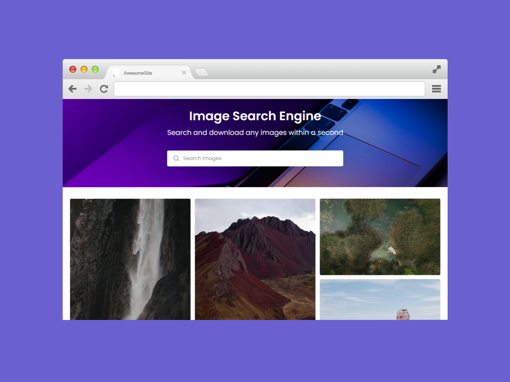
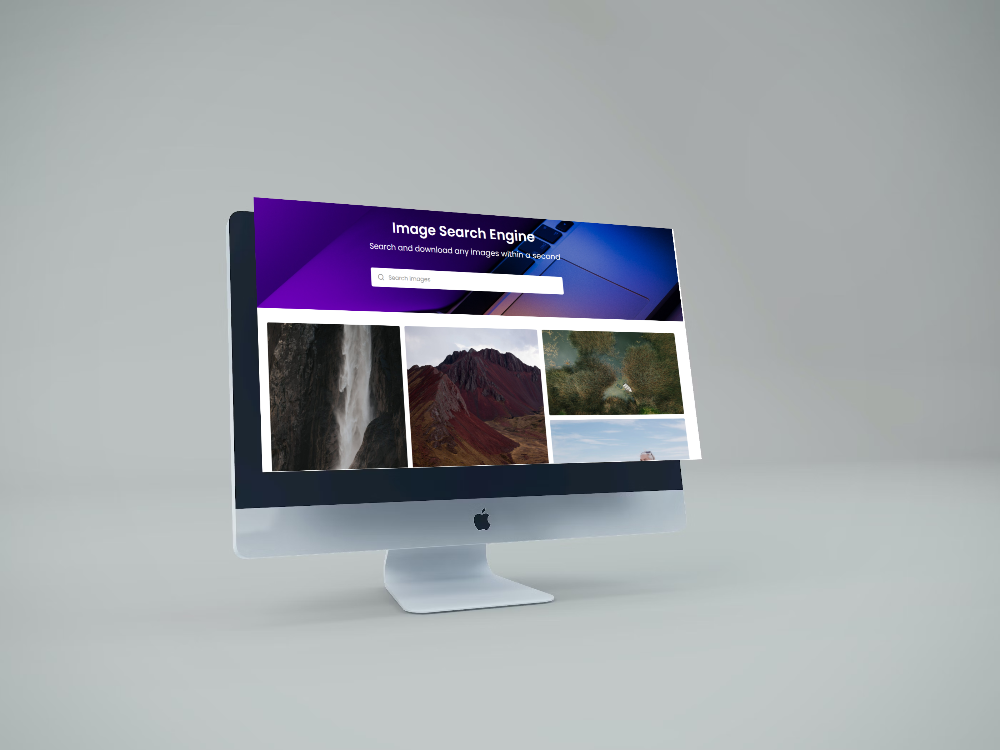

 

  

  <h3 align="center">PixFinder</h3>

  

    Online Image Search Engine
     
     
    <a href="https://github.com/JaysinhDabhi/https://github.com/JaysinhDabhi/">View Demo</a>
    .
    <a href="https://github.com/JaysinhDabhi/https://github.com/JaysinhDabhi//issues">Report Bug</a>
    .
    <a href="https://github.com/JaysinhDabhi/https://github.com/JaysinhDabhi//issues">Request Feature</a>
  

## About The Project

**PixFinder** is a free online image search engine that allows users to find and download high-quality, royalty-free images for any need. Powered by the Pexels API, PixHunt offers a seamless and intuitive experience for both mobile and laptop users.

## Built With

**Frontend:** HTML5, CSS3 (with frameworks like Bootstrap or Tailwind CSS for responsive design), JavaScript (with frameworks like React or Vue.js for enhanced interactivity)  
**Backend:** Pexels API integration

## Features

* Search: Users can enter keywords to search for specific images.
* Filters: Users can filter results by orientation, size, color, and other criteria.
* Image Preview: Hovering over an image displays a larger preview with additional information like size and resolution.
* Download: Users can download high-quality images for free with a single click.
* Responsive Design: The layout adapts to both mobile and laptop devices for a seamless user experience. 

## Demo

<a href="https://github.com/JaysinhDabhi/https://github.com/JaysinhDabhi/">View Demo</a>

## Authors

* **Jaysinh Dabhi** - Full Stack Developer - [Jaysinh Dabhi](https://github.com/JaysinhDabhi/) - Built PixFinder!

